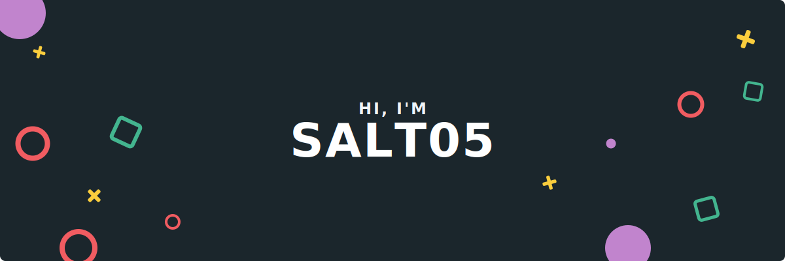

  <h3>🎮 Game Developer Intern | 🛠 System Logic & Backend | 🤖 Vibe Coding Enthusiast</h3>
  
<i>3rd-year Computer Science Student at <b>HUFLIT University</b></i>

  
  

---

### 🚀 Giới Thiệu (About Me)
- 🎓 **Học vấn:** Sinh viên năm 3 chuyên ngành Công nghệ thông tin tại **HUFLIT**.
- 🧠 **Thế mạnh:** Tự tin trong việc **phân tích và xử lý vấn đề**, có khả năng học hỏi và thích nghi cực nhanh với công nghệ mới.
- ⚡ **Workflow:** Theo đuổi xu hướng **Vibe Coding** — tập trung vào tư duy hệ thống và kiến trúc logic, sử dụng AI để tối ưu hóa quy trình phát triển.
- 🗣️ **Ngôn ngữ:** Tiếng Việt 🇻🇳 | Tiếng Anh 🇺🇸

---

### 🛠 Kỹ Năng Công Nghệ

  
  
  
  
  

---

### 📁 Dự Án Tiêu Biểu (Featured Projects)

#### 🦆 [Duck Race – Outcome-Driven Simulation](https://github.com/Salt05)
> Dự án áp dụng triết lý "Directed Race", tách biệt hoàn toàn Logic và Rendering.
- **Logic:** Hệ thống Progress-based (0.0 - 1.0) thay thế cho vật lý truyền thống giúp kiểm soát kịch tính.
- **Kỹ thuật:** Sử dụng thuật toán **Cubic Ease-In ($t^3$)** để đảm bảo sự mượt mà tuyệt đối trong chuyển động.

#### 🧩 [NumStrata – 2D Pixel Puzzle](https://github.com/Salt05/NumStrata)
> Game mobile giải đố toán học với phong cách Pixel Art.
- Tập trung tối ưu hóa UI/UX và xử lý logic toán học hiệu quả trên thiết bị di động.

---

### 📊 Thống Kê Hoạt Động

  
  

  

---

### 🐍 My Contribution Snake

  

