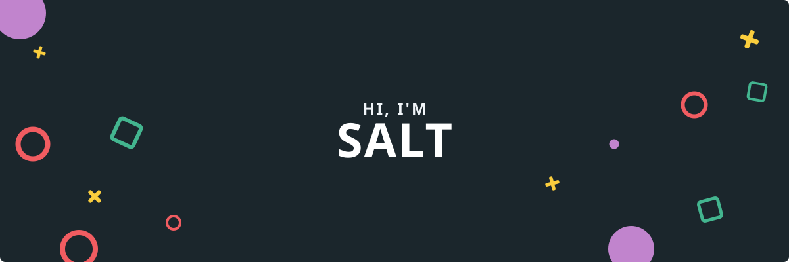

<div align="center">
  
</div>

<h1 align="center">Hi there, I'm Phat (Salt) 👋</h1>

<p align="center">
  <a href="https://komarev.com/ghpvc/?username=Salt05&label=Profile%20views&color=0e75b6&style=flat">
    
  </a>
  <a href="https://github.com/Salt05?tab=followers">
    
  </a>
</p>

<p align="center">
  🎮 Game Dev Intern • 🧠 Logic-first Builder • 🤖 AI-assisted Workflow
</p>

```text
    ____           ______                      __  __    _                
   / __ \____     / ____/   _____  _______  __/ /_/ /_  (_)___  ____ _    
  / / / / __ \   / __/ | | / / _ \/ ___/ / / / __/ __ \/ / __ \/ __ `/    
 / /_/ / /_/ /  / /___ | |/ /  __/ /  / /_/ / /_/ / / / / / / / /_/ /     
/_____/\____/  /_____/ |___/\___/_/   \__, /\__/_/ /_/_/_/ /_/\__, /      
               ______                /____/_                 /____/       
              /_  __/___  ____ ____  / /_/ /_  ___  _____                 
               / / / __ \/ __ `/ _ \/ __/ __ \/ _ \/ ___/                 
              / / / /_/ / /_/ /  __/ /_/ / / /  __/ /                     
             /_/  \____/\__, /\___/\__/_/ /_/\___/_/                      
                       /____/                               
```

## About Me

- 🎓 3rd-year Computer Science student at HUFLIT University.
- 🔭 Currently building game projects with Unity and C#.
- 🌱 Learning backend basics and better game architecture.
- 💬 Ask me about Unity, C#, and game logic.
- 🌍 Languages: Vietnamese (native), English (working).

## Connect With Me

<p align="left">
  <a href="https://www.linkedin.com/in/Salt05" target="_blank"></a>
  <a href="mailto:phathideptrai2k5@gmail.com" target="_blank"></a>
  <a href="https://github.com/Salt05" target="_blank"></a>
</p>

## Languages And Tools

<p align="left">
  <a href="https://skillicons.dev">
    
  </a>
</p>

## Featured Projects

- 🦆 Duck Race - Outcome-driven simulation game architecture.
  - Built with a clear split between game logic and visuals.
  - Focused on smooth movement and fun race pacing.
- 🧩 NumStrata - 2D pixel puzzle mobile game.
  - Focused on puzzle design, simple UX, and mobile performance.

## GitHub Stats

<p align="center">
  
  
</p>

## Motto

<p align="center">
  Build with intention. Learn in public. Improve every commit.
</p>
